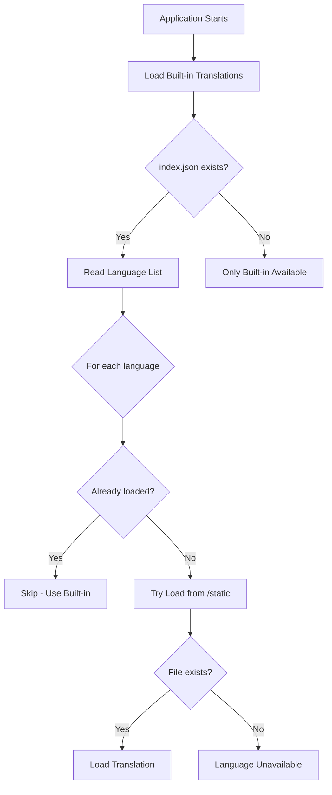

# Translation Loading Priority System

This document explains how the i18n library loads translations with a clear priority system.

## Priority Levels

### 1. **index.json** (Highest Priority)

Located at `/static/translations/index.json`

This file is the **authoritative declaration** of which languages your site supports. It has the highest priority and controls which languages will be available to users.

```json
{
	"availableLanguages": [
		"en",
		"zh",
		"ja",
		"fr",
		"pt" // Can include both built-in and additional languages
	]
}
```

- **Purpose**: Explicitly declare supported languages
- **Priority**: Highest - if a language is not listed here, it won't be available
- **Use case**: Control exactly which languages your site offers

### 2. **Built-in Translations**

Located in `src/translations/` and compiled into the application

These are translations that are bundled with your application at build time. They load instantly without any network requests.

```typescript
// src/translations/i18n.ts
import appEn from './app/en.json';
import appZh from './app/zh.json';
// ... more built-in translations
```

- **Purpose**: Provide core language support with zero latency
- **Priority**: Second - automatically loaded if declared in index.json
- **Use case**: Languages you know you'll always need

### 3. **Static Translation Files**

Located at `/static/translations/{locale}.json`

These are additional translation files that can be added without recompiling the application. They're loaded via HTTP when needed.

```
/static/translations/
  ├── index.json       # Declaration file
  ├── pt.json         # Additional Portuguese translations
  └── custom.json     # Custom language not built-in
```

- **Purpose**: Add new languages post-deployment
- **Priority**: Third - loaded only if declared in index.json but not built-in
- **Use case**: Languages added after deployment or rarely used languages

## Loading Flow



## Examples

### Example 1: Standard Setup

```json
// /static/translations/index.json
{
	"availableLanguages": ["en", "zh", "ja", "fr"]
}
```

- en, zh, ja, fr are built-in → loaded from bundle
- No HTTP requests needed

### Example 2: With Additional Language

```json
// /static/translations/index.json
{
	"availableLanguages": ["en", "zh", "ja", "fr", "pt"]
}
```

- en, zh, ja, fr are built-in → loaded from bundle
- pt is not built-in → loaded from `/static/translations/pt.json`

### Example 3: Subset of Built-in

```json
// /static/translations/index.json
{
	"availableLanguages": ["en", "zh"]
}
```

- Only en and zh will be available (even though more are built-in)
- This is useful for region-specific deployments

## Configuration

### Development Mode

Enable debug logging to see the loading process:

```bash
# .env
VITE_I18N_DEBUG=true
```

### Production Mode

- All loading is silent by default
- 404 errors for missing translations are suppressed
- Only server errors (5xx) are logged

## Best Practices

1. **Always include index.json** in production to explicitly declare supported languages
2. **Bundle frequently used languages** as built-in for best performance
3. **Use static files** for:
   - Languages added post-deployment
   - Region-specific languages
   - Experimental translations
4. **Keep index.json updated** when adding/removing language support

## Troubleshooting

### Language not loading?

1. Check if it's listed in `index.json`
2. Verify the file exists at `/static/translations/{locale}.json`
3. Enable debug mode to see loading attempts

### Too many 404 errors?

1. Ensure `index.json` only lists languages you actually support
2. Built-in languages don't need files in `/static/translations/`

### Want to disable auto-discovery?

Simply don't include `index.json` - only built-in languages will be available.
